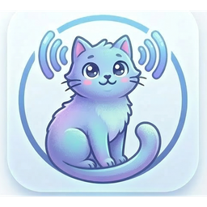

<p align="center">
  
</p>

<h1 align="center">CATTS - Video Transcriber</h1>

<p align="center">
  <strong>Free, open-source media transcription powered by AI</strong>
</p>

<p align="center">
  <a href="https://github.com/taxi-tabby/CATTS-VideoTranscriber/actions/workflows/test.yml"></a>
  <a href="https://github.com/taxi-tabby/CATTS-VideoTranscriber/actions/workflows/build.yml"></a>
  
  
  
</p>

<p align="center">
  
  
  
</p>

<p align="center">
  <a href="https://github.com/taxi-tabby/CATTS-VideoTranscriber/releases">Downloads</a> &bull;
  <a href="docs/README_ko.md">한국어 문서</a>
</p>

---

## Features

| Feature | Description |
|---------|-------------|
| **Speech-to-Text** | Transcribe video/audio using OpenAI Whisper (tiny ~ large-v3) |
| **Speaker Diarization** | Identify speakers via custom VAD + pyannote embeddings + silhouette clustering |
| **Vocal Separation** | Demucs-powered background music/SFX removal for noisy content |
| **Analysis Profiles** | Interview (clean speech) vs Movie/Music (Demucs preprocessing) |
| **Correction Dictionary** | Media-specific word correction with timestamp-aware prompt injection |
| **Hallucination Filter** | Auto-remove Whisper repetitions, language mismatches, no-speech segments |
| **VAD-based Chunking** | Split at silence boundaries, not fixed 30s — prevents mid-word cuts |
| **Real-time Preview** | Watch segments appear as transcription progresses |
| **Crash Recovery** | Resume interrupted transcriptions from where they stopped |
| **Memory Safe** | ML inference runs in subprocess — OS reclaims all memory on completion |
| **Export** | SRT subtitles, plain text |
| **GPU Acceleration** | CUDA support for faster processing |

## Supported Formats

**Video** — mp4, avi, mkv, mov, wmv, flv, webm

**Audio** — mp3, wav, flac, aac, ogg, wma, m4a

## Platform Support

| Platform | Package | Notes |
|----------|---------|-------|
| **Windows** | Portable ZIP, Installer (Inno Setup) | CUDA optional |
| **macOS** | DMG (ad-hoc signed, drag & drop install) | Apple Silicon + Intel |
| **Linux** | tar.gz, .deb, .rpm, AppImage | CPU or CUDA |

## Quick Start

### Download

Get the latest release: [**Releases**](https://github.com/taxi-tabby/CATTS-VideoTranscriber/releases)

### From Source

```bash
git clone https://github.com/taxi-tabby/CATTS-VideoTranscriber.git
cd CATTS-VideoTranscriber

python -m venv venv
# Windows
venv\Scripts\activate
# macOS/Linux
source venv/bin/activate

pip install torch torchaudio --index-url https://download.pytorch.org/whl/cpu
pip install -r requirements.txt

python -m src.main
```

## Processing Pipeline

```
Media File
  │
  ├─ FFmpeg → Audio Extraction (16kHz mono)
  │
  ├─ [noisy profile] Demucs → Vocal Separation
  │
  ├─ High-pass Filter → Noise Reduction → Silero VAD → Trim → Normalize
  │
  ├─ [optional] Speaker Diarization (VAD + pyannote embeddings + clustering)
  │
  ├─ VAD-based Chunking (split at silence, not fixed 30s)
  │
  ├─ Whisper Transcription (with correction dictionary prompt hints)
  │
  ├─ Hallucination Filter (repetition, language mismatch, no_speech)
  │
  └─ Correction Dictionary Post-processing (text replacement)
```

## Tech Stack

| Component | Library |
|-----------|---------|
| GUI | PySide6 (Qt 6) |
| Transcription | OpenAI Whisper |
| Speaker Diarization | pyannote.audio (embeddings), scikit-learn (clustering) |
| Vocal Separation | Demucs (Meta) |
| VAD | Silero VAD |
| Audio Processing | scipy, noisereduce |
| Database | SQLite |
| Packaging | PyInstaller |

## Architecture

```
src/
  main.py               Entry point, theming, selftest
  main_window.py         PySide6 GUI (main window, dialogs, menus)
  transcriber.py         Subprocess-based transcription pipeline
  audio_preprocess.py    Audio preprocessing + Demucs vocal separation
  diarizer.py            Speaker diarization (VAD + embeddings + clustering)
  hallucination_filter.py  Whisper hallucination detection and removal
  dict_analyzer.py       Correction dictionary media analysis engine
  database.py            SQLite persistence + correction dictionary storage
  config.py              User configuration
  model_utils.py         Whisper model cache management
  crash_reporter.py      Error reporting with system info collection
```

## Testing

```bash
python -m pytest tests/ --cov=src --cov-fail-under=60 -v
```

170 tests, 71% coverage. CI runs on every PR via GitHub Actions.

## Contributing

Contributions welcome. See [CONTRIBUTING.md](CONTRIBUTING.md) for guidelines.

This project is developed with [Claude Code](https://claude.ai/claude-code). Using it for contributions is recommended.

## License

MIT

## Built with Claude

Designed, implemented, and maintained with [Claude](https://claude.ai) by Anthropic.
